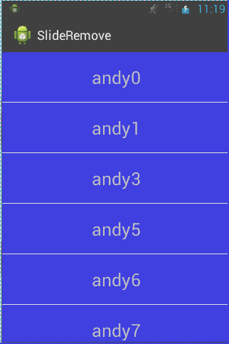

# SplideRemoveMenu
滑动删除菜单

1.完成滑动删除，动画描述

2.Simple Demo

	1.布局文件（作为ListView的Item）
		
		<com.example.slideremove.SlideRemoveLib
        android:id="@+id/srl_remove"
        android:layout_width="fill_parent"
        android:layout_height="70dp" >

        <!-- 內容部分 -->

        <include layout="@layout/content" />
        <!-- delete部分 -->

        <include layout="@layout/delete" />
   		 </com.example.slideremove.SlideRemoveLib>

	2.给ListView绑定适配器

		listView = getListView();
		myAdapter = new MyAdapter();
		listView.setAdapter(myAdapter);

	3.适配器数据显示

		@Override
		public View getView(final int position, View convertView, ViewGroup parent) {
			
			 ViewHolder vHolder = null;
			
			if(convertView == null){
				convertView = View.inflate(getApplicationContext(), R.layout.activity_main, null);
				vHolder  = new ViewHolder();
				
				vHolder.sl_test = (SlideRemoveLib) convertView.findViewById(R.id.srl_remove);
				vHolder.content = (TextView) convertView.findViewById(R.id.tv_content);
				vHolder.delete = (TextView) convertView.findViewById(R.id.tv_delete);
				
				convertView.setTag(vHolder);
				
			}else{
				vHolder = (ViewHolder) convertView.getTag();
			}
			
			
			String msg = getItem(position);
			vHolder.content.setText(msg);
			
			final ViewHolder finalViewHolder = vHolder;
			
			//点击删除事件
			vHolder.delete.setOnClickListener(new OnClickListener() {
				
				@Override
				public void onClick(View v) {
					mDatas.remove(position);
					finalViewHolder.sl_test.noShowDeleteView();
					myAdapter.notifyDataSetChanged();
				}
			});
			
			
			return convertView;
		}

END....It's here,you can do what you want to do.
